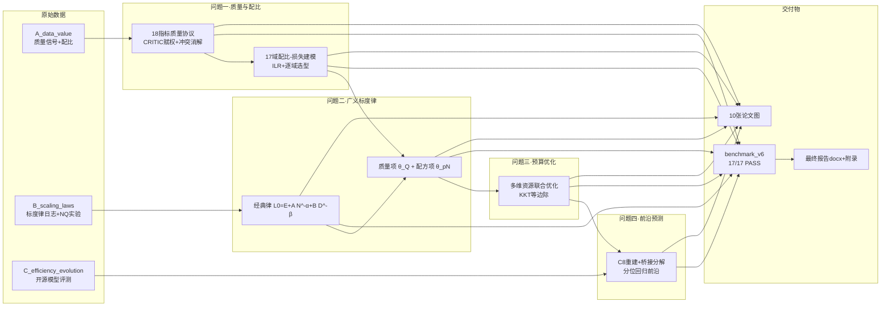
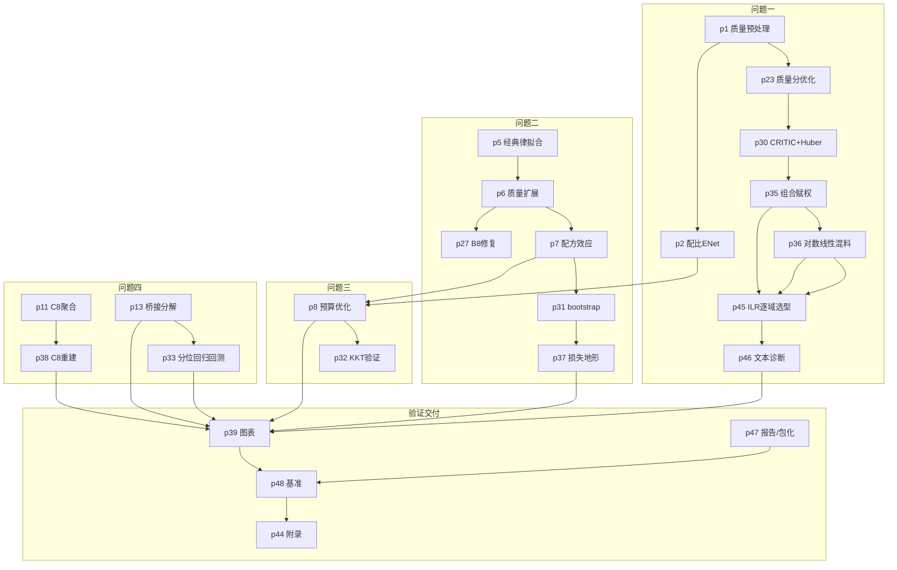

# 项目结构说明 · 依赖关系与数据流

本文档说明本项目的目录层次、路径约定、模块间依赖关系与数据流向，帮助成员快速定位资源、理解建模脉络。

---

## 一、路径约定与可移植性

所有脚本通过共享工具 `modeling/scripts/qcommon.py` 推导路径，**摆脱硬编码盘符**：

```python
# qcommon.py 核心（位于 modeling/scripts/ 下）
REPO = Path(__file__).resolve().parents[2]      # = real_attachments（scripts → modeling → real_attachments）
ROOT = Path(os.environ.get("MODEL_DATA_DIR", REPO / "data" / "raw"))  # 原始数据根（可环境变量覆盖）
MV   = REPO                                      # 工作目录根（outputs/figures/configs 均在其下）
```

| 变量 | 默认值 | 用途 | 覆盖方式 |
|------|--------|------|----------|
| `REPO` | `real_attachments` | 仓库/工作区根 | 随脚本位置自动推导 |
| `ROOT` | `REPO/data/raw` | 原始数据根（A/B/C） | `$env:MODEL_DATA_DIR` |
| `MV` | `REPO` | 输出/图/配置根 | 随脚本位置自动推导 |

> **关键约束**：脚本用 `ROOT / "A_data_value" / ...`、`MV / "outputs" / ...` 定位文件，因此 **`scripts/`、`outputs/`、`configs/` 等目录不可随意移动或改名**，否则路径推导失效。本项目以「文档化分层 + 命名规范」实现逻辑组织，而不物理迁移文件。

---

## 二、模块划分总览

按功能将 55 个脚本划分为六大模块（详见 [SCRIPTS.md](SCRIPTS.md)）：

| 模块 | 说明 | 代表脚本 |
|------|------|----------|
| **共享工具** | 路径推导 + 日志 + 计时 | `qcommon.py` |
| **数据预处理** | 质量信号清洗/标量化、C8 逐任务聚合、探查 | `p1`、`p11`、`p21`、`p23` |
| **模型构建** | 四问核心建模（配比/标度律/优化/前沿） | `p2`、`p5/p6`、`p8`、`p13` |
| **评估验证** | 基准套件、KKT/bootstraap/分位回归、断言审计、多框架 | `p31`、`p32`、`p33`、`p48`、`p50`–`p52` |
| **可视化** | 论文级图表（10 张） | `p39` |
| **交付/文档** | 附录、报告、包化 | `p44`、`p47` |

---

## 三、数据流总览

原始数据经预处理进入建模，四问沿「质量/配比 → 标度律 → 优化 → 预测」递进，最终收敛到基准与报告：



**数据流关键接口**：

| 接口 | 载体 | 说明 |
|------|------|------|
| 问题一 → 问题二 | `outputs/q1_qstar_inference_v2.csv` / `q1_opt_q2_bridge_v1.json` | 17 域质量分 Q_star + 一阶替代向量 t |
| 问题二 → 问题三 | `outputs/scaling_classical_params_v1.json` + `scaling_quality_extension_v1.json` | 广义律参数锚定 |
| 问题三 → 问题四 | `outputs/budget_optimal_primary_v1.csv` | 最优配置轨迹 N*(C) |
| 四问 → 验证 | `outputs/benchmark_v6.json` | 17 项复检判定 |

---

## 四、四问脚本依赖链（主线）



> 完整逐脚本分类见 [SCRIPTS.md](SCRIPTS.md)。

---

## 五、版本演进脉络

| 版本 | 主题 | 关键增量 |
|------|------|----------|
| v1 | 初始建模 | 四问主链 p0–p25 |
| v2 | 瓶颈修复 | Q_star 结构化推断、B8 机制修复、分解断点 |
| v3 | 方法学升级 | 组级 CRITIC+Huber、bootstrap、KKT 验证、分位回归+回测 |
| v4 | 论文级优化 | 组合赋权、区间型指标、四类代理模型、损失地形、C8 重建、10 图 |
| v5 | 残余限制改进 | 协议拆分、去身份化 65/35、13 域反向主判据 |
| v6 | 成分处理与逐域选型 | ILR+逐域选型(0.896)、A17/A18 抽查、抽样代表性、λ 敏感性 |
| v7 | 验证强化 | 多框架交叉验证、BIC+配对显著性、论文断言审计、跨尺度收缩律、闭环验证 |
| v9 | 对标优化 | 参考仓库对照增强（intND_add/twoQ 双通道质量项 + ens3 集成）、统一对比实验框架、六战场全面胜出（B8 R² 0.988 为决定性战场） |
